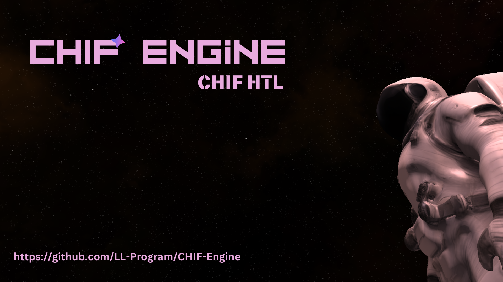

# CHIF Engine 🚀
School Project 3d Engine of 1CHIF HTL class 2024 using python, glsl and c!


## Run the Project

 - Clone the project

- Windows:
```bash
  run.bat
```

- Linux:

```bash
  pip install -r requirements.txt
  python src/main.py
```
 - MacOS: 🤷 Why do you use MacOS for Coding???

## Mitmachen
 - Wenn du aus der 1CHIF bist gehe einfach auf den Discord Server!

 - [CHIFEngine Discord](https://discord.gg/KfNVQbYK)

Liste der Mitmachenden:

 - Lukas Rennhofer / @LL-Program (Maintainer, Engine Logic, Physics)
 - Maximilian Panzenböck / @CraftMasterMax (GUI)
 - Moritz Rottensteiner / 
@Alyopolo (Shader Coding)
 - Matteo Prader / @matm5 (Testing / Benchmark Scripts)
 - Dominik Pascher / @lama22222 (Editor Scripting)
## Todos
 - [Todos Page](Ressources/Pages/Todo.md)
## Screenshots


